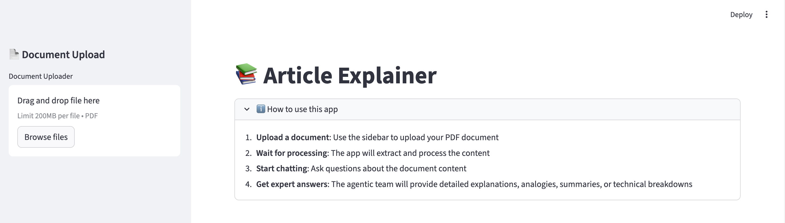
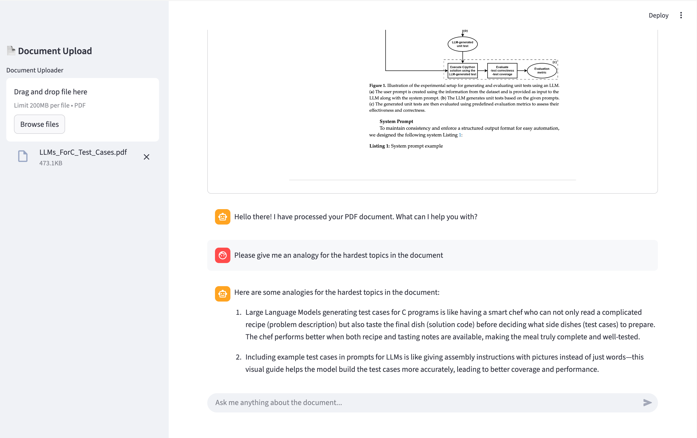

# Article Explainer

An intelligent document analysis tool that helps you understand complex technical articles through AI-powered
explanations, analogies, and summaries. A good introduction to the Swarm Architecture from LangChain.

Article I wrote about Swarm at: https://medium.com/@caldasdcardoso/swarm-architecture-agents-in-langgraph-b8b1b53c61b3

LangChain documentation at: https://langchain-ai.github.io/langgraph/agents/multi-agent/#swarm

## Features

- **PDF Upload & Processing**: Upload technical documents and get instant access for asking questions
- **Multi-Expert System**: Specialized agents work together to provide comprehensive explanations
- **PDF Viewer**: See your PDF within the main page for added context
- **Interactive Chat Interface**: Ask questions and get tailored responses
- **Smart Collaboration**: Agents automatically work together for complex queries
- **Document Analysis Tools**: Extract key terms, analyze structure, and assess complexity
- **Observability Integration**: Built-in Synqui integration for monitoring agent interactions and performance

## Application

### Usage explanation and interface


### Interactive chat with the agentic team



## Quick Start

### Installation

(If you have not set up uv yet, visit: https://docs.astral.sh/uv/getting-started/installation/)

1. Install dependencies:

```bash
uv sync
```

2. Set up environment variables:

```bash
# Required for the application
export GOOGLE_API_KEY="your-google-api-key-here"

# Optional: Synqui observability (recommended)
export SYNQUI_PROJECT_API_KEY="your-synqui-api-key-here"
export SYNQUI_PROJECT_NAME="article-explainer"
export SYNQUI_ENDPOINT="http://localhost:8000"
export SYNQUI_ENVIRONMENT="development"
# Or use SYNQUI_MODE for backward compatibility:
# export SYNQUI_MODE="development"
export SYNQUI_DEBUG="false"
```

### Usage

#### Docker 

1. Build and run with Docker Compose:

```bash
docker build -t article_explainer .
docker compose up -d
```

2. Open your browser at `http://localhost:8501`

#### Web Interface (Local development)

Launch the Streamlit web interface:

```bash
uv run streamlit run article_explainer_page.py
```

1. Open your browser at `http://localhost:8501`

## Observability with Synqui

This application includes built-in observability through Synqui, allowing you to monitor:

- **Agent Interactions**: Track how the 5 specialized agents collaborate
- **Performance Metrics**: Monitor response times and processing efficiency  
- **User Behavior**: Understand query patterns and document complexity
- **System Health**: Monitor PDF processing and agent performance

### Synqui Setup

1. **Get your API key**: Sign up at [Synqui](https://synqui.com) to get your project API key
2. **Configure environment**: Set the `SYNQUI_PROJECT_API_KEY` environment variable
3. **View traces**: Access the Synqui dashboard to see real-time agent interactions

The application will automatically start tracing when Synqui is configured, with no additional code changes needed.

## Example Queries

- "Summarize this document"
- "Explain the most complex concepts with analogies"
- "Provide code samples for the most interesting topics"
- "Give me a TL;DR with the key technical details"
- "Are there security vulnerabilities associated with the content?"
