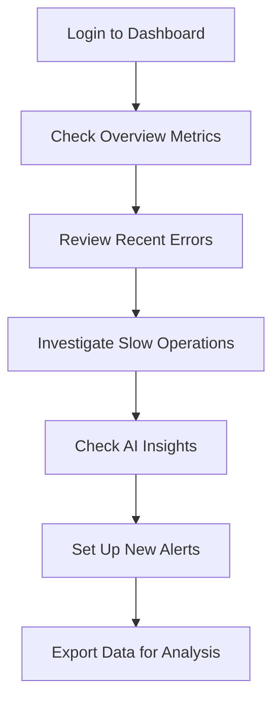

# 🎛️ Dashboard Overview

Your traces are being collected! The Vaquero dashboard is where you'll analyze performance, debug issues, and gain insights into your AI workflows. This is the primary interface for understanding your observability data.

## 🌐 Accessing the Dashboard

### Step 1: Navigate to Vaquero
1. Go to **[https://app.vaquero.com](https://app.vaquero.com)**
2. **Sign in** with your account credentials
3. **Select your project** from the project dropdown (if you have multiple)

### Step 2: Dashboard Layout
Once logged in, you'll see the main dashboard with several key sections:

#### 📊 **Overview Panel**
- **Key Metrics**: Requests per second, error rate, average response time
- **Recent Activity**: Latest traces and alerts
- **Quick Actions**: Jump to trace explorer or insights

#### 🔍 **Trace Explorer**
- **Filter Controls**: Agent name, time range, status, duration
- **Search Bar**: Find traces by ID, agent name, or content
- **Trace List**: Paginated list with key information
- **Sorting Options**: By duration, timestamp, status, etc.

#### 📈 **Performance Charts**
- **Trend Analysis**: Performance over time
- **Agent Comparison**: Performance by agent type
- **Error Patterns**: Error frequency and types
- **Resource Usage**: Memory, CPU, network utilization

#### 💡 **Insights Panel**
- **AI-Generated Insights**: Automatic analysis of your traces
- **Optimization Suggestions**: Specific recommendations for improvement
- **Pattern Recognition**: Common issues and solutions

## 🔍 Finding Your Traces

### Basic Filtering
```typescript
// Example filter combinations
{
  agent_name: "data_processor",
  time_range: "last_24h",
  status: "success",
  min_duration: "100ms"
}
```

### Advanced Search
```typescript
// Complex search with multiple criteria
{
  query: "error OR timeout",
  agent_names: ["api_client", "database"],
  time_range: {
    start: "2024-01-01T00:00:00Z",
    end: "2024-01-02T00:00:00Z"
  },
  tags: {
    team: "backend",
    environment: "production"
  }
}
```

## 📊 Understanding Trace Details

### Execution Flow Visualization
When you click on a trace, you'll see a detailed breakdown:

#### **1. Timeline View**
```
┌─────────────────────────────────────────────────────────┐
│ data_processor (2.1s)                                  │
├─────────────────────────────────────────────────────────┤
│ ├── validate_input (45ms)                              │
│ ├── process_data (1.8s)                                 │
│ │   ├── database_query (1.2s)                          │
│ │   └── transform_result (580ms)                       │
│ └── save_results (250ms)                               │
└─────────────────────────────────────────────────────────┘
```

#### **2. Performance Breakdown**
- **Total Duration**: End-to-end execution time
- **Operation Details**: Time spent in each component
- **Resource Usage**: Memory, CPU, I/O metrics
- **Network Activity**: API calls, database queries

#### **3. Context & Metadata**
- **Input Parameters**: Function arguments (if captured)
- **Return Values**: Output data (if captured)
- **Custom Attributes**: Domain-specific metadata
- **Error Information**: Stack traces and error context

## 💡 AI-Powered Insights

### Insight Types
The dashboard uses AI to analyze your trace patterns and provide actionable insights:

#### **1. Performance Insights**
```json
{
  "type": "performance",
  "confidence": 0.85,
  "finding": "Database queries in 'user_lookup' agent are 3x slower than average",
  "recommendation": "Consider adding database connection pooling or query optimization",
  "evidence": "Average query time: 245ms vs expected: 80ms",
  "affected_traces": 1,247,
  "potential_savings": "2.1 hours/day"
}
```

#### **2. Error Pattern Analysis**
```json
{
  "type": "error_pattern",
  "confidence": 0.92,
  "finding": "API rate limiting errors occur every 15 minutes",
  "recommendation": "Implement exponential backoff retry logic",
  "evidence": "429 errors spike at regular intervals",
  "pattern_frequency": "15-minute cycle",
  "suggested_fix": "Add retry decorator with exponential backoff"
}
```

#### **3. Optimization Opportunities**
```json
{
  "type": "optimization",
  "confidence": 0.78,
  "finding": "Batch processing could reduce API calls by 60%",
  "recommendation": "Increase batch_size from 10 to 50 for this workflow",
  "evidence": "Current pattern: 100 individual API calls vs potential: 2 batch calls",
  "estimated_impact": "40% cost reduction, 60% faster processing"
}
```

## 📈 Performance Monitoring

### Real-time Metrics
Monitor your application performance in real-time:

#### **1. Throughput Metrics**
- **Requests per Second**: Current and historical throughput
- **Concurrent Operations**: Active operations count
- **Queue Depth**: Pending operations in processing pipeline

#### **2. Error Tracking**
- **Error Rate**: Percentage of failed operations
- **Error Types**: Breakdown by error category
- **Error Trends**: Error patterns over time

#### **3. Resource Utilization**
- **CPU Usage**: Processing load across agents
- **Memory Consumption**: Memory usage by agent type
- **Network I/O**: API call frequency and data transfer

### Trend Analysis
Identify performance patterns and degradation:

#### **1. Performance Degradation Detection**
- **Slow Query Detection**: Database queries getting slower
- **Memory Leak Identification**: Gradual memory increase
- **API Performance Changes**: External service slowdowns

#### **2. Peak Usage Analysis**
- **Daily Patterns**: When your application is busiest
- **Seasonal Trends**: Weekly/monthly usage patterns
- **Anomaly Detection**: Unusual spikes in activity

## 🎯 Dashboard Best Practices

### ✅ Effective Usage Patterns
- **Start Broad**: Begin with overview metrics, then drill down into specifics
- **Set Baselines**: Establish normal performance ranges for comparison
- **Create Alerts**: Set up proactive monitoring for critical thresholds
- **Regular Reviews**: Schedule weekly performance reviews with your team
- **Share Insights**: Use dashboard findings to inform architectural decisions

### ❌ Common Pitfalls to Avoid
- **Don't Ignore Insights**: AI recommendations often catch issues you miss
- **Avoid Alert Fatigue**: Set appropriate thresholds to prevent false alarms
- **Don't Over-Filter**: Start with broader views before narrowing down
- **Skip Context**: Always consider business impact when analyzing performance
- **Forget Environment Context**: Compare similar environments (dev vs prod)

## 🔧 Dashboard Customization

### Custom Views
Create dashboards tailored to your team's needs:

#### **1. Team-Specific Dashboards**
```yaml
# ML Team Dashboard
widgets:
  - type: "trace_explorer"
    filters:
      agent_name: ["ml_model", "data_processor", "feature_extractor"]
    columns: ["agent", "duration", "status", "model_version"]

  - type: "performance_chart"
    metric: "average_duration"
    group_by: "agent_name"
    time_range: "1h"

  - type: "error_summary"
    group_by: "error_type"
    time_range: "24h"
```

#### **2. Project-Specific Views**
```yaml
# Customer Support Dashboard
widgets:
  - type: "trace_explorer"
    filters:
      tags:
        team: "customer_support"
    columns: ["agent", "user_id", "status", "duration"]

  - type: "cost_tracker"
    metric: "llm_cost"
    group_by: "user_type"
    time_range: "7d"
```

### Alert Configuration
Set up intelligent alerting for your workflows:

```yaml
alerts:
  - name: "High Error Rate"
    condition: "error_rate > 0.05"  # 5% error rate
    timeframe: "5m"
    severity: "high"
    notification_channels: ["slack", "email"]
    cooldown: "15m"

  - name: "Slow Performance"
    condition: "p95_duration > 1000ms"  # 95th percentile > 1s
    timeframe: "10m"
    severity: "medium"
    notification_channels: ["slack"]

  - name: "Cost Spike"
    condition: "daily_cost > $100"
    timeframe: "1d"
    severity: "medium"
    notification_channels: ["email", "slack"]
```

## 📤 Data Export & Integration

### Export Capabilities
Export trace data for external analysis:

#### **1. Bulk Export**
```python
# Export traces for analysis
import vaquero

# Get traces for specific time period
traces = vaquero.export_traces(
    start_time="2024-01-01T00:00:00Z",
    end_time="2024-01-02T00:00:00Z",
    agent_names=["data_processor", "api_client"],
    format="json"  # or "csv", "parquet"
)

# Save to file
with open("trace_analysis.json", "w") as f:
    json.dump(traces, f, indent=2)
```

#### **2. API Access**
```python
# Programmatic access to dashboard data
import requests

response = requests.get(
    "https://api.vaquero.com/v1/projects/{project_id}/traces",
    headers={"Authorization": "Bearer your-api-key"},
    params={
        "start_time": "2024-01-01T00:00:00Z",
        "limit": 100,
        "agent_name": "data_processor",
        "status": "error"
    }
)

error_traces = response.json()
```

## 🚨 Troubleshooting Dashboard Issues

### Traces Not Appearing
1. **Check SDK Configuration**: Verify API key and endpoint settings
2. **Network Connectivity**: Test API endpoint reachability
3. **Project Selection**: Ensure you're viewing the correct project
4. **Time Range**: Check if traces are outside the selected time range
5. **Agent Filtering**: Verify agent names match what's being traced

### Performance Data Missing
1. **Check Trace Collection**: Verify traces are being sent successfully
2. **Attribute Verification**: Ensure performance attributes are being set
3. **Refresh Dashboard**: Some metrics update on refresh
4. **Browser Cache**: Clear browser cache and reload

### Access Issues
1. **Account Verification**: Confirm your account has project access
2. **API Key Permissions**: Check if your key has dashboard access
3. **Browser Compatibility**: Try a different browser if issues persist
4. **VPN/Network**: Check if corporate network is blocking access

## 🎯 Dashboard Workflow

### Daily Usage Pattern


### Weekly Review Process
1. **Monday**: Review weekend performance and error patterns
2. **Wednesday**: Deep dive into specific agent performance
3. **Friday**: Plan next week's optimizations based on insights

## 🎯 Next Steps

Now that you can navigate the dashboard:

1. **[→ Detailed Trace Analysis](./trace-analysis.md)** - Deep dive into individual traces
2. **[→ Insights & Analytics](./insights-analytics.md)** - Master AI-powered insights
3. **[→ Custom Dashboards](../advanced-usage/custom-dashboards.md)** - Build team-specific views

## 🆘 Need Help?

- **Dashboard Guide**: [Complete Analytics Guide](./)
- **Community**: [Discord](https://discord.gg/vaquero)
- **Support**: support@vaquero.app

---

**[← Back to Observability Platform](../index.md#observability-platform)** | **[→ Next: Trace Analysis](./trace-analysis.md)**
