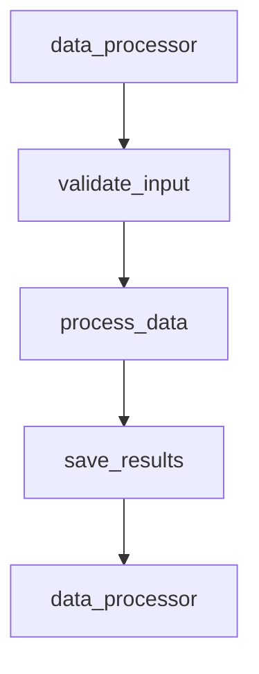

# 🎛️ Dashboard Access & Analysis

Your traces are being collected! Now let's explore them in the Vaquero dashboard - this is where you'll analyze performance, debug issues, and gain insights into your AI workflows.

## 🌐 Accessing the Dashboard

### Step 1: Navigate to Vaquero
1. Go to **[https://www.vaquero.app](https://www.vaquero.app)**
2. **Sign in** with your account credentials
3. **Select your project** from the project dropdown (if you have multiple)

### Step 2: Dashboard Overview
Once logged in, you'll see the main dashboard with:

- **📊 Overview Panel**: Key metrics and recent activity
- **🔍 Trace Explorer**: Browse and filter your traces
- **📈 Performance Charts**: Visualize trends and patterns
- **💡 Insights Panel**: AI-generated recommendations

## 🔍 Finding Your Traces

### Trace Explorer
The **Trace Explorer** is your primary tool for finding and analyzing traces:

<div class="trace-explorer-demo">

### Filter Options
- **Agent Name**: Filter by specific agents (`data_processor`, `api_client`, etc.)
- **Time Range**: Last hour, day, week, or custom range
- **Status**: Success, error, or all traces
- **Duration**: Filter by execution time
- **Tags**: Filter by custom tags you added

### Search Features
- **Text Search**: Search trace names, attributes, or error messages
- **Advanced Filters**: Combine multiple filters for precise results
- **Sorting**: Sort by duration, timestamp, or other metrics

</div>

## 📊 Trace Analysis

### Understanding Trace Details
When you click on a trace, you'll see:

#### **1. Execution Flow**


#### **2. Performance Metrics**
- **Total Duration**: End-to-end execution time
- **Operation Breakdown**: Time spent in each span
- **Resource Usage**: Memory, CPU, network I/O
- **Error Rates**: Success/failure patterns

#### **3. Context & Metadata**
- **Function Arguments**: Input parameters (if captured)
- **Return Values**: Output data (if captured)
- **Custom Attributes**: Domain-specific metadata
- **Environment Info**: Runtime, dependencies, configuration

#### **4. Error Analysis**
- **Stack Traces**: Complete error context
- **Error Patterns**: Similar failures across traces
- **Root Cause Analysis**: Identify common failure points

## 💡 AI-Powered Insights

### Accessing Insights
The **Insights** panel uses AI to analyze your trace patterns:

#### **1. Performance Insights**
```python
# Example insights you might see:
{
    "type": "performance",
    "confidence": 0.85,
    "finding": "Database queries in 'user_lookup' agent are 3x slower than average",
    "recommendation": "Consider adding database connection pooling or query optimization",
    "evidence": "Average query time: 245ms vs expected: 80ms"
}
```

#### **2. Error Pattern Analysis**
```python
{
    "type": "error_pattern",
    "confidence": 0.92,
    "finding": "API rate limiting errors occur every 15 minutes",
    "recommendation": "Implement exponential backoff retry logic",
    "evidence": "429 errors spike at regular intervals"
}
```

#### **3. Optimization Opportunities**
```python
{
    "type": "optimization",
    "confidence": 0.78,
    "finding": "Batch processing could reduce API calls by 60%",
    "recommendation": "Increase batch_size from 10 to 50 for this workflow",
    "evidence": "Current pattern: 100 individual API calls vs potential: 2 batch calls"
}
```

## 📈 Performance Monitoring

### Dashboard Metrics
Monitor key performance indicators:

#### **1. Real-time Metrics**
- **Requests per Second**: Current throughput
- **Error Rate**: Percentage of failed operations
- **Average Response Time**: End-to-end latency
- **Resource Utilization**: CPU, memory, network usage

#### **2. Trend Analysis**
- **Performance Over Time**: Identify degradation patterns
- **Peak Usage Periods**: Understand load patterns
- **Error Spike Detection**: Alert on unusual error rates

#### **3. Comparative Analysis**
- **Agent Performance**: Compare different agents
- **Environment Comparison**: Dev vs staging vs production
- **Version Tracking**: Performance changes after deployments

## 🔧 Dashboard Configuration

### Custom Dashboards
Create dashboards tailored to your needs:

#### **1. Team-Specific Views**
```yaml
# Example: ML Team Dashboard
widgets:
  - type: "trace_explorer"
    filters:
      agent_name: ["ml_model", "data_processor", "feature_extractor"]
    columns: ["agent", "duration", "status", "model_version"]

  - type: "performance_chart"
    metric: "average_duration"
    group_by: "agent_name"
    time_range: "1h"
```

#### **2. Alert Configuration**
Set up alerts for critical issues:

```yaml
alerts:
  - name: "High Error Rate"
    condition: "error_rate > 0.05"
    timeframe: "5m"
    severity: "high"
    notification_channels: ["slack", "email"]

  - name: "Slow Performance"
    condition: "p95_duration > 1000ms"
    timeframe: "10m"
    severity: "medium"
    notification_channels: ["slack"]
```

## 🔍 Advanced Analysis Features

### Trace Comparison
Compare different executions:

#### **1. Side-by-Side Analysis**
- Compare successful vs failed executions
- Identify differences in execution paths
- Spot performance regressions

#### **2. Pattern Recognition**
- Detect common execution patterns
- Identify optimization opportunities
- Find similar error scenarios

### Export & Integration
Export trace data for external analysis:

#### **1. Data Export**
```python
# Export traces for analysis
import vaquero

# Get traces for analysis
traces = vaquero.export_traces(
    start_time="2024-01-01T00:00:00Z",
    end_time="2024-01-02T00:00:00Z",
    agent_names=["data_processor"],
    format="json"  # or "csv", "parquet"
)

# Save to file
with open("trace_analysis.json", "w") as f:
    json.dump(traces, f, indent=2)
```

#### **2. API Integration**
```python
# Programmatic access to dashboard data
import requests

response = requests.get(
    "https://api.vaquero.com/v1/projects/{project_id}/traces",
    headers={"Authorization": "Bearer your-api-key"},
    params={
        "start_time": "2024-01-01T00:00:00Z",
        "limit": 100,
        "agent_name": "data_processor"
    }
)

traces = response.json()
```

## 🎯 Best Practices

### ✅ Dashboard Usage Tips
- **Start Broad**: Begin with overview metrics, then drill down
- **Set Baselines**: Establish normal performance ranges for comparison
- **Create Alerts**: Set up proactive monitoring for critical metrics
- **Regular Reviews**: Schedule weekly performance reviews
- **Share Insights**: Use insights to inform team decisions

### ❌ Common Pitfalls
- **Don't Ignore Insights**: AI recommendations often catch issues you miss
- **Avoid Alert Fatigue**: Set appropriate thresholds to avoid false alarms
- **Don't Over-Filter**: Start with broader views before narrowing down
- **Skip Context**: Always consider the business context of performance issues

## 🚨 Troubleshooting Dashboard Issues

### Traces Not Appearing
1. **Check SDK Configuration**: Verify API key and endpoint
2. **Network Connectivity**: Test API endpoint reachability
3. **Project Selection**: Ensure you're viewing the correct project
4. **Time Range**: Check if traces are outside the selected time range

### Performance Data Missing
1. **Check Trace Collection**: Verify traces are being sent successfully
2. **Attribute Verification**: Ensure performance attributes are being set
3. **Refresh Dashboard**: Some metrics update on refresh

### Access Issues
1. **Account Verification**: Confirm your account has project access
2. **API Key Permissions**: Check if your key has dashboard access
3. **Browser Compatibility**: Try a different browser if issues persist

## 🎯 Next Steps

Now that you can analyze your traces:

1. **[→ Integrate with LangChain](../agent-frameworks/langchain-integration.md)** - For AI agent workflows
2. **[→ Set up monitoring](../sdk-reference/configuration.md)** - Configure alerts and dashboards
3. **[→ Explore advanced features](../advanced-usage/)** - Custom instrumentation and optimization

## 🆘 Need Help?

- **Dashboard Guide**: [Complete Analytics Guide](../observability-platform/)
- **Community**: [Discord](https://discord.gg/vaquero)
- **Support**: support@vaquero.app

---

**[← Previous: First Trace](./first-trace.md)** | **[→ Next: SDK Reference](../sdk-reference/)**
